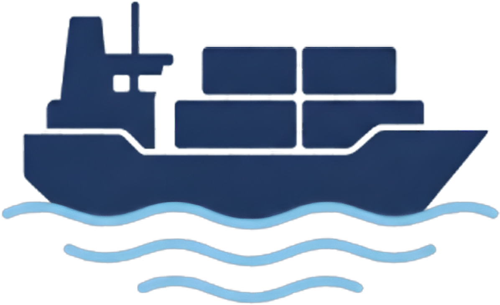
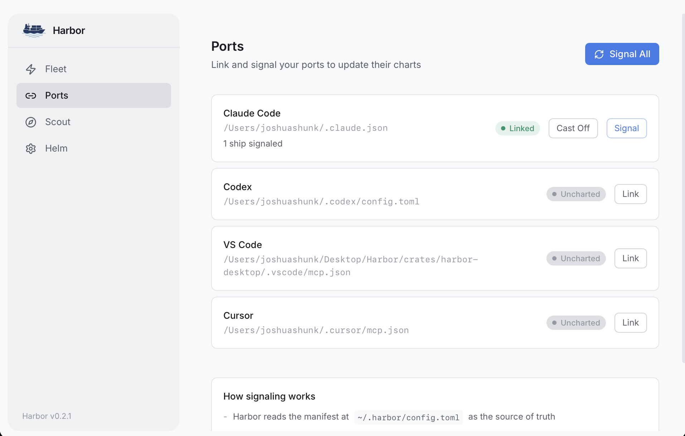

<p align="center">
  <a href="https://harbormcp.ai">
    <picture>
      <source media="(prefers-color-scheme: dark)" srcset=".github/assets/logo-dark.png">
      <source media="(prefers-color-scheme: light)" srcset="ui/src/assets/logo.png">
      
    </picture>
  </a>
</p>

<h1 align="center">Harbor</h1>

<p align="center">
  <strong>Universal MCP Hub — discover, install, run, and sync MCP servers across every host.</strong>
</p>

<p align="center">
  <a href="https://github.com/JoshuaShunk/Harbor/releases/latest"></a>
  <a href="https://github.com/JoshuaShunk/Harbor/actions/workflows/ci.yml"></a>
  <a href="https://github.com/JoshuaShunk/Harbor/blob/main/LICENSE"></a>
  <a href="https://github.com/JoshuaShunk/Harbor/releases"></a>
</p>

<p align="center">
  <a href="https://harbormcp.ai">Website</a> · <a href="https://github.com/JoshuaShunk/Harbor/releases/latest">Download</a> · <a href="https://github.com/JoshuaShunk/Harbor/discussions">Discussions</a> · <a href="https://github.com/JoshuaShunk/Harbor/issues">Issues</a>
</p>

---

<p align="center">
  <picture>
    <source media="(prefers-color-scheme: dark)" srcset=".github/assets/screenshot-dark.png">
    <source media="(prefers-color-scheme: light)" srcset=".github/assets/screenshot-light.png">
    
  </picture>
</p>

## What is Harbor?

Harbor is a desktop app and CLI that manages [MCP (Model Context Protocol)](https://modelcontextprotocol.io) servers from a single place. Instead of editing JSON and TOML configs by hand across every host, you dock servers once and Harbor syncs them everywhere.

- **One config, every host** — sync to Claude Code, Codex, VS Code, and Cursor simultaneously
- **Marketplace** — search and install MCP servers from [Smithery](https://smithery.ai) without leaving the app
- **Secret vault** — store API keys in your OS keychain, reference them as `vault:SECRET_NAME`
- **HTTP/SSE gateway** — expose your MCP servers over HTTP for remote access and tool discovery
- **Desktop + CLI** — full GUI built with Tauri, or use the CLI for automation and scripting
- **Safe merges** — Harbor never overwrites your host configs, it merges its servers in alongside yours

## Quick Start

### Desktop App

Download the latest release for your platform:

**[Download Harbor](https://github.com/JoshuaShunk/Harbor/releases/latest)**

> macOS (Apple Silicon & Intel) available now. Windows and Linux coming soon.

### CLI

Build from source:

```sh
git clone https://github.com/JoshuaShunk/Harbor.git
cd Harbor
cargo install --path crates/harbor-cli
```

### Your First Server

```sh
# Dock a server
harbor dock --name memory --command npx --args @modelcontextprotocol/server-memory

# Sync to all connected hosts
harbor signal

# Check your fleet
harbor fleet
```

## CLI Reference

Harbor uses a nautical theme — every command has a standard alias if you prefer.

| Command | Alias | Description |
|---------|-------|-------------|
| `harbor dock` | `add` | Dock a new MCP server into the harbor |
| `harbor undock` | `remove` | Undock a server and cast it off |
| `harbor fleet` | `list` | Review your fleet of docked servers |
| `harbor launch` | `start` | Launch a server out to sea |
| `harbor anchor` | `stop` | Drop anchor on a running server |
| `harbor manifest` | `status` | Read the harbor manifest |
| `harbor signal` | `sync` | Signal connected hosts to update their charts |
| `harbor lighthouse` | `gateway` | Light the lighthouse (HTTP/SSE gateway) |
| `harbor scout` | `search` | Scout the seas for MCP servers on Smithery |
| `harbor chest` | `vault` | Open the treasure chest (secret vault) |

## Supported Hosts

| Host | Config File | Sync Key |
|------|------------|----------|
| Claude Code | `~/.claude.json` | `mcpServers` |
| Codex | `~/.codex/config.toml` | `mcp_servers` |
| VS Code | `.vscode/mcp.json` | `servers` |
| Cursor | `~/.cursor/mcp.json` | `mcpServers` |

## Configuration

Harbor stores its config at `~/.harbor/config.toml`. You can edit it directly or manage everything through the app and CLI.

### Vault References

Store secrets in your OS keychain and reference them in server environment variables:

```sh
# Store a secret
harbor chest set OPENAI_API_KEY sk-...

# Reference it in a server
harbor dock --name my-server --command npx --args my-mcp-server \
  --env OPENAI_API_KEY=vault:OPENAI_API_KEY
```

Vault references are resolved at sync time — your secrets never end up in plain-text config files.

### Gateway

Start an HTTP/SSE gateway to expose your MCP servers over the network:

```sh
harbor lighthouse --port 3100
```

This starts a server with endpoints for tool discovery (`GET /tools`), JSON-RPC (`POST /mcp`), and server-sent events (`GET /sse`).

## Architecture

Harbor is a Rust workspace with three crates:

```
harbor-core     Core library — config, connectors, gateway, vault, marketplace
harbor-cli      CLI binary — clap-based command interface
harbor-desktop  Desktop app — Tauri v2 shell wrapping the React frontend
```

**Tech stack:** Rust, Tauri v2, React 19, TypeScript, Tailwind CSS, Axum

## Building from Source

### Prerequisites

- [Rust](https://rustup.rs/) (1.75+)
- [Node.js](https://nodejs.org/) (20+)
- [Tauri CLI](https://v2.tauri.app/start/prerequisites/)

### Desktop App

```sh
git clone https://github.com/JoshuaShunk/Harbor.git
cd Harbor

# Install frontend dependencies
cd ui && npm ci && npm run build && cd ..

# Run in development
cd crates/harbor-desktop && cargo tauri dev

# Or build for production
cd crates/harbor-desktop && cargo tauri build
```

### CLI Only

```sh
cargo build --release -p harbor-cli
```

## Contributing

Contributions are welcome! Please read the [Contributing Guide](CONTRIBUTING.md) before submitting a pull request.

## License

[MIT](LICENSE)
